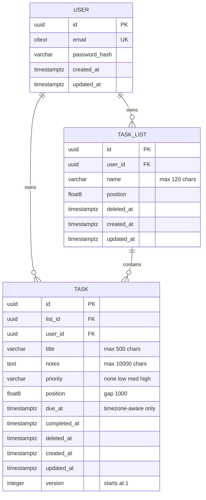

# Locked Decisions for Story c4c0d49b-f396-4efc-903e-3595fd392ee2

## Implementation Approach
## Layered Implementation — Router → Service → ORM

### Files to Create/Modify

| File | Action | Purpose |
|---|---|---|
| `app/models/task.py` | **Create** | SQLAlchemy ORM model for `task` table |
| `app/schemas/task.py` | **Create** | `TaskCreate` request + `TaskResponse` response Pydantic models |
| `app/schemas/enums.py` | **Create** | `Priority` string enum (`none`, `low`, `med`, `high`) |
| `app/services/task_service.py` | **Create** | `create_task()` business logic |
| `app/api/v1/tasks.py` | **Create** | POST `/v1/tasks` router |
| `app/api/v1/__init__.py` | **Modify** | Register tasks router under `/v1/tasks` prefix |
| `alembic/versions/xxx_create_task_table.py` | **Create** | Migration: task table, constraints, indexes |

### Service Layer Logic (`task_service.create_task`)

1. **Verify list ownership**: Query `task_list` filtered by `id = list_id AND user_id = user_id`. If no row, raise 404 (not 403 — prevents resource enumeration per the security decision).
2. **Resolve position**:
   - If `position` is provided → use it directly
   - If omitted → `SELECT COALESCE(MAX(position), 0) + 1000 FROM task WHERE list_id = :list_id AND deleted_at IS NULL`
3. **Create task**: Insert a new `Task` row with `user_id` explicitly set from `current_user.id` (never from request body).
4. **Commit and return**: The session commits on success via the dependency's context manager; the service returns the ORM instance, which the router serializes via `TaskResponse`.

### Key Design Choices

- **`user_id` on the task is set server-side**, derived from the JWT — never accepted from the request body. This, combined with the composite FK `(list_id, user_id) → task_list(id, user_id)`, makes cross-tenant task creation impossible at the database level.
- **Position query uses `FOR UPDATE` row-level locking** on the max-position query to prevent race conditions when two concurrent requests create tasks in the same list. This is a lightweight lock scoped to the list.
- **The service receives `user_id: UUID` as a plain parameter** (not the request object or a scoped global) — per the architecture constraint.
- **The ORM model uses `lazy="raise"` on all relationships** — no lazy loading in async context. If task-list details are needed in future endpoints, use explicit `selectinload`.

### ORM Model Pattern
```python
class Task(Base):
    __tablename__ = "task"

    id: Mapped[uuid.UUID] = mapped_column(primary_key=True, server_default=func.gen_random_uuid())
    list_id: Mapped[uuid.UUID] = mapped_column(ForeignKey("task_list.id"), nullable=False)
    user_id: Mapped[uuid.UUID] = mapped_column(ForeignKey("user.id"), nullable=False)
    title: Mapped[str] = mapped_column(String(500), nullable=False)
    notes: Mapped[str | None] = mapped_column(Text, nullable=True)
    priority: Mapped[str] = mapped_column(String(4), nullable=False, server_default="none")
    position: Mapped[float] = mapped_column(Float, nullable=False)
    due_at: Mapped[datetime | None] = mapped_column(DateTime(timezone=True), nullable=True)
    completed_at: Mapped[datetime | None] = mapped_column(DateTime(timezone=True), nullable=True)
    deleted_at: Mapped[datetime | None] = mapped_column(DateTime(timezone=True), nullable=True)
    created_at: Mapped[datetime] = mapped_column(DateTime(timezone=True), server_default=func.now())
    updated_at: Mapped[datetime] = mapped_column(DateTime(timezone=True), server_default=func.now(), onupdate=func.now())
    version: Mapped[int] = mapped_column(Integer, nullable=False, server_default="1")
```

### Dependency Chain
This story depends on prior stories having established:
- `User` model and `user` table (Registration story)
- `TaskList` model and `task_list` table (Create a Task List story)
- `get_current_user` dependency (Login story)
- `get_session` dependency and DB engine (app bootstrap)
- Shared `CamelBase` Pydantic model with `alias_generator`
- Error envelope handler (`app/core/errors.py`)

## Data Mapping
## Task Table Schema (New — Greenfield)

This is a greenfield project with no existing tables. The `task` table is the core table introduced by this story. It depends on `user` and `task_list` tables (introduced by the Registration and Create a Task List stories respectively).

### ER Diagram



### Column Details

| Column | Type | Nullable | Default | Notes |
|---|---|---|---|---|
| `id` | `UUID` | NO | `gen_random_uuid()` | PK, generated by `pgcrypto` |
| `list_id` | `UUID` | NO | — | FK to `task_list.id` |
| `user_id` | `UUID` | NO | — | FK to `user.id`, denormalized for tenant isolation |
| `title` | `VARCHAR(500)` | NO | — | 1–500 chars, not blank |
| `notes` | `TEXT` | YES | `NULL` | Max 10,000 chars (enforced at app layer) |
| `priority` | `VARCHAR(4)` | NO | `'none'` | Enum-like: `none`, `low`, `med`, `high` |
| `position` | `DOUBLE PRECISION` | NO | — | Integer-gap strategy (gap = 1000); typed as float8 for future midpoint insertion |
| `due_at` | `TIMESTAMPTZ` | YES | `NULL` | Timezone-aware only; naive values rejected at app layer |
| `completed_at` | `TIMESTAMPTZ` | YES | `NULL` | Set when task is completed; null on creation |
| `deleted_at` | `TIMESTAMPTZ` | YES | `NULL` | Soft-delete marker |
| `created_at` | `TIMESTAMPTZ` | NO | `now()` | Immutable |
| `updated_at` | `TIMESTAMPTZ` | NO | `now()` | Updated on every modification |
| `version` | `INTEGER` | NO | `1` | Optimistic concurrency; incremented on each update |

### Constraints

| Constraint | Type | Definition |
|---|---|---|
| `pk_task` | PRIMARY KEY | `(id)` |
| `fk_task_list` | FOREIGN KEY | `(list_id) REFERENCES task_list(id)` |
| `fk_task_user` | FOREIGN KEY | `(user_id) REFERENCES "user"(id)` |
| `fk_task_list_same_owner` | FOREIGN KEY (composite) | `(list_id, user_id) REFERENCES task_list(id, user_id)` — prevents task/list owner mismatch at the DB level |
| `ck_task_title_not_blank` | CHECK | `char_length(trim(title)) > 0` |
| `ck_task_priority` | CHECK | `priority IN ('none', 'low', 'med', 'high')` |

### Indexes

| Index | Columns | Condition | Purpose |
|---|---|---|---|
| `ix_task_list_position` | `(list_id, position)` | `WHERE deleted_at IS NULL` | Fast ordered listing of active tasks within a list |
| `ix_task_user` | `(user_id)` | — | Tenant-scoped queries |
| `ix_task_purge` | `(deleted_at)` | `WHERE deleted_at IS NOT NULL` | Purge job efficiency (find tasks deleted > 30 days) |

### Composite FK Prerequisite
The `fk_task_list_same_owner` composite FK requires a **unique constraint** `(id, user_id)` on `task_list`. This must be added in the task_list migration or a preceding migration.

### Position Strategy
- **Gap constant**: 1000
- **New task (position omitted)**: `COALESCE(MAX(position), 0) + 1000` within the list (filtered to `deleted_at IS NULL`)
- **New task (position provided)**: Use the provided value directly
- Column is `DOUBLE PRECISION` to support midpoint insertion in the "Move and Reorder" story without schema change

## Validation
## Input Validation & Error Handling

### Validation Rules (Pydantic Layer)

| Field | Rule | Error |
|---|---|---|
| `listId` | Required, valid UUID | 422 — `field: "listId"` |
| `title` | Required, 1–500 chars, not blank after `strip()` | 422 — `field: "title"` with specific message for blank vs. too-long |
| `notes` | Optional, max 10,000 chars | 422 — `field: "notes"` |
| `dueAt` | Optional, must be timezone-aware (`tzinfo is not None`) | 422 — `field: "dueAt"`, message: "Datetime must include timezone info" |
| `priority` | Optional, must be one of `none`, `low`, `med`, `high`; defaults to `none` | 422 — `field: "priority"` |
| `position` | Optional, float | 422 if not a valid number |

### Pydantic Validators

**Title — blank-after-strip check:**
```python
@field_validator("title")
@classmethod
def title_not_blank(cls, v: str) -> str:
    if not v.strip():
        raise ValueError("Title must not be blank")
    return v
```
Note: `min_length=1` catches empty strings; the validator catches whitespace-only strings. `max_length=500` catches length overflow. Together they enforce AC #6.

**dueAt — timezone-aware enforcement:**
```python
@field_validator("due_at")
@classmethod
def due_at_must_be_aware(cls, v: datetime | None) -> datetime | None:
    if v is not None and v.tzinfo is None:
        raise ValueError("Datetime must include timezone information")
    return v
```
This implements AC #8 — naive datetimes are rejected with 422, not silently normalized.

### Service-Layer Validation

| Check | Behavior |
|---|---|
| List ownership | Query `task_list WHERE id = list_id AND user_id = user_id`. No row → raise `ResourceNotFoundError("List not found")` → 404. Uses 404 (not 403) per AC #5 to prevent resource enumeration. |

### Error Response Format

All validation errors use the locked error envelope from `app/core/errors.py`:

```json
{
  "error": {
    "code": "validation_error",
    "message": "Request validation failed",
    "details": [
      { "field": "title", "message": "Title must not be blank" },
      { "field": "notes", "message": "String should have at most 10000 characters" }
    ]
  }
}
```

Pydantic's `RequestValidationError` is caught by a FastAPI exception handler that transforms the native error list into the standard envelope. Multiple validation errors are returned together (not fail-fast on the first).

### Edge Cases

| Scenario | Behavior |
|---|---|
| Title is only whitespace (e.g., `"   "`) | 422 — blank-after-strip validator |
| Title is exactly 500 chars | Accepted |
| Title is 501 chars | 422 — max_length |
| Notes is exactly 10,000 chars | Accepted |
| Notes is 10,001 chars | 422 — max_length |
| `dueAt` is `"2025-03-15T10:00:00"` (no TZ) | 422 — naive datetime rejected |
| `dueAt` is `"2025-03-15T10:00:00Z"` | Accepted (UTC) |
| `dueAt` is `"2025-03-15T10:00:00+05:30"` | Accepted (offset-aware) |
| `priority` is `"urgent"` | 422 — not in enum |
| `priority` omitted | Defaults to `"none"` |
| `listId` is valid UUID but belongs to another user | 404 |
| `listId` is valid UUID but doesn't exist at all | 404 (same response — no existence leak) |
| `position` omitted | Auto-assigned: `max(position) + 1000` |
| `position` provided as negative | Accepted (no business constraint against it) |
| `completedAt` sent in request body | Ignored — not in `TaskCreate` schema, so Pydantic silently drops it |

## API Design
## POST /v1/tasks — Create a Task

### Endpoint
`POST /v1/tasks`

### Authentication
Bearer JWT required (`get_current_user` dependency). Returns 401 if missing/invalid.

### Request Body (camelCase wire format)
```json
{
  "listId": "uuid (required)",
  "title": "string (required, 1–500 chars)",
  "notes": "string (optional, max 10,000 chars)",
  "dueAt": "datetime with timezone (optional, ISO 8601)",
  "priority": "string (optional, one of: none, low, med, high)",
  "position": "number (optional, float)"
}
```

### Pydantic Request Schema (`TaskCreate`)
- `list_id: UUID` — required
- `title: str` — `Field(min_length=1, max_length=500)`, with a validator that rejects blank-after-strip
- `notes: str | None = None` — `Field(max_length=10_000)`
- `due_at: datetime | None = None` — must have `tzinfo` set (validator rejects naive datetimes)
- `priority: Priority = Priority.NONE` — `Priority` is a `str` enum: `none`, `low`, `med`, `high`
- `position: float | None = None` — when omitted, service auto-assigns

All fields use `alias_generator=to_camel` from the shared `CamelBase` model, bridging snake_case Python ↔ camelCase JSON.

### Response — 201 Created (`TaskResponse`)
```json
{
  "id": "uuid",
  "listId": "uuid",
  "title": "string",
  "notes": "string | null",
  "dueAt": "datetime | null",
  "priority": "none | low | med | high",
  "position": 1000.0,
  "completedAt": null,
  "deletedAt": null,
  "createdAt": "datetime",
  "updatedAt": "datetime",
  "version": 1
}
```

### Error Responses

| Status | Condition | Error Code |
|---|---|---|
| 401 | Missing/invalid JWT | `authentication_required` |
| 404 | `listId` not owned by user (or doesn't exist) | `resource_not_found` |
| 422 | Validation failure (title, notes, dueAt, priority) | `validation_error` |

All errors use the locked error envelope: `{ "error": { "code": "...", "message": "...", "details": [...] } }`

### Error Envelope Examples

**422 — blank title:**
```json
{
  "error": {
    "code": "validation_error",
    "message": "Request validation failed",
    "details": [
      { "field": "title", "message": "Title must not be blank" }
    ]
  }
}
```

**404 — list not owned:**
```json
{
  "error": {
    "code": "resource_not_found",
    "message": "List not found"
  }
}
```

### Router Implementation Pattern
```python
@router.post("", status_code=status.HTTP_201_CREATED, response_model=TaskResponse)
async def create_task(
    body: TaskCreate,
    current_user: CurrentUser = Depends(get_current_user),
    session: AsyncSession = Depends(get_session),
) -> TaskResponse:
    task = await task_service.create_task(
        session=session,
        user_id=current_user.id,
        data=body,
    )
    return task
```

The router delegates entirely to the service — no SQLAlchemy in the router, per the locked architecture.
