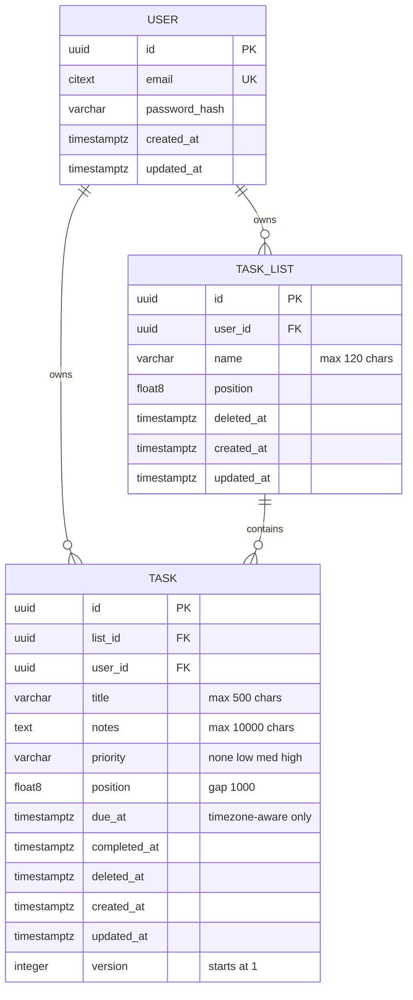

# Data Mapping

## Task Table Schema (New — Greenfield)

This is a greenfield project with no existing tables. The `task` table is the core table introduced by this story. It depends on `user` and `task_list` tables (introduced by the Registration and Create a Task List stories respectively).

### ER Diagram

### Column Details

| Column | Type | Nullable | Default | Notes |
|---|---|---|---|---|
| `id` | `UUID` | NO | `gen_random_uuid()` | PK, generated by `pgcrypto` |
| `list_id` | `UUID` | NO | — | FK to `task_list.id` |
| `user_id` | `UUID` | NO | — | FK to `user.id`, denormalized for tenant isolation |
| `title` | `VARCHAR(500)` | NO | — | 1–500 chars, not blank |
| `notes` | `TEXT` | YES | `NULL` | Max 10,000 chars (enforced at app layer) |
| `priority` | `VARCHAR(4)` | NO | `'none'` | Enum-like: `none`, `low`, `med`, `high` |
| `position` | `DOUBLE PRECISION` | NO | — | Integer-gap strategy (gap = 1000); typed as float8 for future midpoint insertion |
| `due_at` | `TIMESTAMPTZ` | YES | `NULL` | Timezone-aware only; naive values rejected at app layer |
| `completed_at` | `TIMESTAMPTZ` | YES | `NULL` | Set when task is completed; null on creation |
| `deleted_at` | `TIMESTAMPTZ` | YES | `NULL` | Soft-delete marker |
| `created_at` | `TIMESTAMPTZ` | NO | `now()` | Immutable |
| `updated_at` | `TIMESTAMPTZ` | NO | `now()` | Updated on every modification |
| `version` | `INTEGER` | NO | `1` | Optimistic concurrency; incremented on each update |

### Constraints

| Constraint | Type | Definition |
|---|---|---|
| `pk_task` | PRIMARY KEY | `(id)` |
| `fk_task_list` | FOREIGN KEY | `(list_id) REFERENCES task_list(id)` |
| `fk_task_user` | FOREIGN KEY | `(user_id) REFERENCES "user"(id)` |
| `fk_task_list_same_owner` | FOREIGN KEY (composite) | `(list_id, user_id) REFERENCES task_list(id, user_id)` — prevents task/list owner mismatch at the DB level |
| `ck_task_title_not_blank` | CHECK | `char_length(trim(title)) > 0` |
| `ck_task_priority` | CHECK | `priority IN ('none', 'low', 'med', 'high')` |

### Indexes

| Index | Columns | Condition | Purpose |
|---|---|---|---|
| `ix_task_list_position` | `(list_id, position)` | `WHERE deleted_at IS NULL` | Fast ordered listing of active tasks within a list |
| `ix_task_user` | `(user_id)` | — | Tenant-scoped queries |
| `ix_task_purge` | `(deleted_at)` | `WHERE deleted_at IS NOT NULL` | Purge job efficiency (find tasks deleted > 30 days) |

### Composite FK Prerequisite
The `fk_task_list_same_owner` composite FK requires a **unique constraint** `(id, user_id)` on `task_list`. This must be added in the task_list migration or a preceding migration.

### Position Strategy
- **Gap constant**: 1000
- **New task (position omitted)**: `COALESCE(MAX(position), 0) + 1000` within the list (filtered to `deleted_at IS NULL`)
- **New task (position provided)**: Use the provided value directly
- Column is `DOUBLE PRECISION` to support midpoint insertion in the "Move and Reorder" story without schema change
